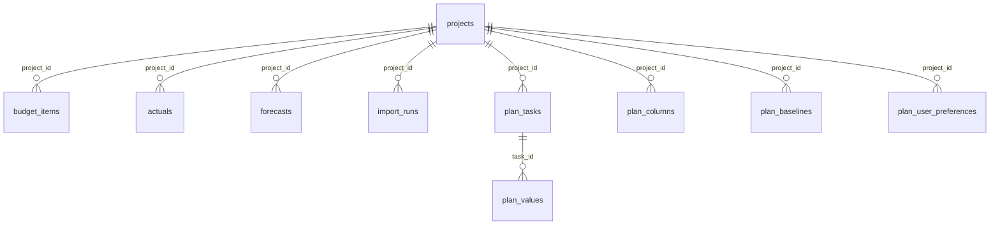
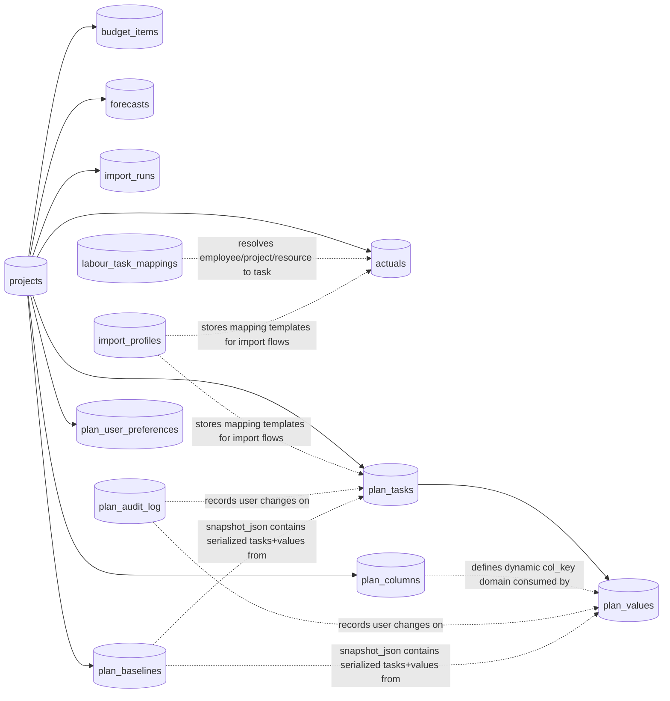

# Budget Planner – AI-Assisted PM Budget Management

Streamline your project budgeting workflow with Budget Planner, a unified platform for planning costs, importing actuals, and tracking budget performance in real time.

## What It Does

**Budget Planner** helps teams move from spreadsheets to a structured, data-driven budgeting process. Import both labor and non-labor costs, compare actuals against your plan, and spot variances before they become problems.

**Key capabilities:**
- 📊 **Plan & Track** – Create flexible task-based budgets with monthly allocations
- 📥 **Smart Import** – Load labor and cost data with intelligent column mapping and preview validation
- 📈 **Real-Time Analytics** – View actuals trends, cumulative spending, and variance analysis by task or project
- 💾 **One Source of Truth** – SQLite-backed persistence with shared layouts across your team
- ⚡ **Built for Speed** – Streamlit UI that's intuitive and responsive

## Tech Stack

| Component | Technology |
|-----------|-----------|
| Interface | Streamlit |
| Data Processing | Pandas, Plotly |
| Storage | SQLite |
| Language | Python 3.10 |

## Quick Start

```bash
# Set up environment
conda create -n budgetplanner python=3.10
conda activate budgetplanner
pip install streamlit pandas plotly openpyxl

# Run the app
streamlit run app.py
```

Open `http://localhost:8501` and start planning.

---

Built with **GitHub Copilot** and vibe coding for rapid, practical development. Ready for team collaboration.

## Purpose

This application supports end-to-end project cost management:
- Build and update annual/monthly budget plans by task.
- Track actual costs (manual and imported files).
- Map labour bookings to tasks.
- Freeze baselines (for business plan / current forecast checkpoints).
- Keep an audit trail of budget planning changes.
- Compare plan vs actual vs forecast.

## Current Core Features

### 1. Project Management
- Create, update, and delete projects.
- Project metadata: name, description, start date, end date, status.

### 2. Budget Planning
- Task-based planning table with inline editing.
- Required planning metadata:
  - Task Name
  - Cost Type (Labor cost / Direct cost)
  - Resource Group
  - Employees (for labor-related planning)
- Dynamic columns:
  - Month columns generated from project date range.
  - Custom columns can be added/removed.
- Annual distribution options:
  - Enter monthly values directly.
  - Enter annual values and distribute equally across months.
- Automatic calculation support:
  - If Rate/hour and Annual hours columns are present and filled, annual cost is auto-calculated and distributed equally across months.
- Baselines:
  - Freeze snapshots such as BP26, CF02, CF05, etc.
  - Download snapshots for manual transfer to external tools (for example MCR).
- Audit logging:
  - Tracks who changed what and when.

### 3. Actuals Management
- Manual entry of actual costs.
- File import for:
  - Cost actuals
  - Labour actuals
- Import profiles (column mapping templates).
- Raw actual entry review.

### 4. Labour Mapping
- Dedicated mapping tab for employee-to-task mapping.
- Inline mapping table edit/delete workflow.
- Mapping import support.
- Auto-apply mapping to existing unmapped labour actuals.
- Unmapped labour actuals visibility section.

### 5. Forecast and Variance
- Estimate to Complete (ETC) by category.
- EAC and variance views combining plan, actuals, and forecasts.

## Technology Stack
- Python
- Streamlit
- SQLite
- Pandas
- Plotly
- OpenPyXL

## Repository Structure
- app.py: Streamlit UI and workflow logic
- db.py: SQLite schema, migrations, and database access helpers
- budget_planner.db: Local SQLite database
- Start Budget Planner.bat: Windows launcher

## Local Setup

### Prerequisites
- Python environment (Conda environment recommended)
- Packages:
  - streamlit
  - pandas
  - plotly
  - openpyxl

### Install (example)
```powershell
pip install streamlit pandas plotly openpyxl
```

### Run
```powershell
streamlit run app.py
```

Or start via:
- Start Budget Planner.bat

## Data Schema

This section documents the current SQLite schema implemented in `db.py` (`init_db()` + lightweight migrations).

### Relationship overview
- `projects` is the root table.
- Child tables with `project_id -> projects.id` (ON DELETE CASCADE):
  - `budget_items`
  - `actuals`
  - `forecasts`
  - `import_runs`
  - `plan_tasks`
  - `plan_columns`
  - `plan_baselines`
  - `plan_user_preferences`
- `plan_values.task_id -> plan_tasks.id` (ON DELETE CASCADE)
- `labour_task_mappings` has no FK, used as a lookup table during labour import/mapping.

### ER Diagram (compact)



### ER Diagram (extended, includes logical links)



### Tables and columns

#### 1) projects
- `id` INTEGER PRIMARY KEY AUTOINCREMENT
- `name` TEXT NOT NULL UNIQUE
- `description` TEXT
- `start_date` TEXT
- `end_date` TEXT
- `status` TEXT DEFAULT 'Active'
- `created_at` TEXT DEFAULT date('now')

#### 2) budget_items
- `id` INTEGER PRIMARY KEY AUTOINCREMENT
- `project_id` INTEGER NOT NULL (FK -> projects.id, CASCADE)
- `category` TEXT NOT NULL
- `description` TEXT
- `planned` REAL DEFAULT 0
- `month` TEXT  (YYYY-MM or NULL)

#### 3) actuals
- `id` INTEGER PRIMARY KEY AUTOINCREMENT
- `project_id` INTEGER NOT NULL (FK -> projects.id, CASCADE)
- `category` TEXT NOT NULL
- `description` TEXT
- `amount` REAL DEFAULT 0
- `date` TEXT
- `source` TEXT DEFAULT 'Manual'
- `task_name` TEXT
- `employee_name` TEXT
- `resource_group` TEXT
- `project_no` TEXT
- `import_file` TEXT

#### 4) import_runs
- `id` INTEGER PRIMARY KEY AUTOINCREMENT
- `project_id` INTEGER NOT NULL (FK -> projects.id, CASCADE)
- `import_type` TEXT NOT NULL
- `file_name` TEXT
- `row_count` INTEGER DEFAULT 0
- `imported_at` TEXT DEFAULT datetime('now')

#### 5) forecasts
- `id` INTEGER PRIMARY KEY AUTOINCREMENT
- `project_id` INTEGER NOT NULL (FK -> projects.id, CASCADE)
- `category` TEXT NOT NULL
- `etc` REAL DEFAULT 0
- `note` TEXT
- `updated_at` TEXT DEFAULT date('now')

#### 6) import_profiles
- `id` INTEGER PRIMARY KEY AUTOINCREMENT
- `profile_name` TEXT NOT NULL UNIQUE
- `profile_type` TEXT DEFAULT 'actuals'
- `settings_json` TEXT NOT NULL
- `updated_at` TEXT DEFAULT date('now')

#### 7) labour_task_mappings
- `id` INTEGER PRIMARY KEY AUTOINCREMENT
- `project_no` TEXT
- `employee_name` TEXT NOT NULL
- `resource_group` TEXT
- `task_name` TEXT NOT NULL
- `task_description` TEXT
- `is_active` INTEGER DEFAULT 1
- `updated_at` TEXT DEFAULT date('now')
- `hours` REAL DEFAULT 0
- `rate` REAL DEFAULT 0
- `total` REAL DEFAULT 0
- Unique constraint: `(project_no, employee_name, resource_group)`

#### 8) plan_tasks
- `id` INTEGER PRIMARY KEY AUTOINCREMENT
- `project_id` INTEGER NOT NULL (FK -> projects.id, CASCADE)
- `task_name` TEXT NOT NULL
- `cost_type` TEXT NOT NULL DEFAULT 'Direct cost'
- `resource_group` TEXT DEFAULT ''
- `employees` TEXT DEFAULT ''
- `sort_order` INTEGER DEFAULT 0
- `is_active` INTEGER DEFAULT 1
- `created_at` TEXT DEFAULT datetime('now')

#### 9) plan_values
- `id` INTEGER PRIMARY KEY AUTOINCREMENT
- `task_id` INTEGER NOT NULL (FK -> plan_tasks.id, CASCADE)
- `col_key` TEXT NOT NULL
- `value` REAL DEFAULT 0
- `updated_at` TEXT DEFAULT datetime('now')
- `updated_by` TEXT DEFAULT ''
- Unique constraint: `(task_id, col_key)`

#### 10) plan_columns
- `id` INTEGER PRIMARY KEY AUTOINCREMENT
- `project_id` INTEGER NOT NULL (FK -> projects.id, CASCADE)
- `col_key` TEXT NOT NULL
- `col_label` TEXT NOT NULL
- `col_type` TEXT DEFAULT 'custom'
- `sort_order` INTEGER DEFAULT 100
- Unique constraint: `(project_id, col_key)`

#### 11) plan_baselines
- `id` INTEGER PRIMARY KEY AUTOINCREMENT
- `project_id` INTEGER NOT NULL (FK -> projects.id, CASCADE)
- `baseline_name` TEXT NOT NULL
- `created_at` TEXT DEFAULT datetime('now')
- `created_by` TEXT DEFAULT ''
- `snapshot_json` TEXT NOT NULL
- Unique constraint: `(project_id, baseline_name)`

#### 12) plan_audit_log
- `id` INTEGER PRIMARY KEY AUTOINCREMENT
- `project_id` INTEGER NOT NULL
- `task_id` INTEGER
- `task_name` TEXT
- `col_key` TEXT
- `old_value` TEXT
- `new_value` TEXT
- `action` TEXT DEFAULT 'update'
- `changed_at` TEXT DEFAULT datetime('now')
- `changed_by` TEXT DEFAULT ''

#### 13) plan_user_preferences
- `id` INTEGER PRIMARY KEY AUTOINCREMENT
- `project_id` INTEGER NOT NULL (FK -> projects.id, CASCADE)
- `user_name` TEXT NOT NULL
- `pref_key` TEXT NOT NULL
- `pref_value` TEXT NOT NULL
- `updated_at` TEXT DEFAULT datetime('now')
- Unique constraint: `(project_id, user_name, pref_key)`

### Schema update rule
- The source of truth is `db.py:init_db()` plus its migration blocks.
- Whenever any table/column/constraint/migration changes in `db.py`, update this Data Schema section in the same change set.

## Operational Notes
- Baseline transfer to external planning systems is currently manual by design.
- The app performs lightweight schema migration in db.init_db() for backward compatibility.
- The database is local SQLite; back up budget_planner.db regularly.

## Maintenance Policy

This README is the living documentation for the solution.

Any business logic change or other important behavior change must include a README update in the same commit/change set.

When new functionality is implemented, update at minimum:
1. Current Core Features
2. Repository Structure (if files/folders changed)
3. Data Schema (if schema changed)
4. Operational Notes (if workflow changed)
5. Change Log

## Change Log

### 2026-05-11
- Expanded README from high-level data model list to full Data Schema documentation.
- Documented table-level relationships, keys, constraints, and columns for all current SQLite tables.
- Added explicit schema maintenance rule: update README Data Schema whenever `db.py:init_db()` or migrations change.

### 2026-04-24
- Added initial project README with architecture, setup, feature map, and maintenance policy.
- Documented Budget Planning enhancements:
  - Task-based planning with baselines and audit trail
  - Dynamic columns
  - Annual distribution support
  - Rate/Hours driven annual auto-calculation and month distribution
- Documented Actuals and labour mapping workflow updates.

## Next Documentation Updates (template)

When updating this solution, append a new entry here:

```text
### YYYY-MM-DD
- Summary of functional change
- UI changes
- Database/schema changes
- Migration or operational impacts
```
